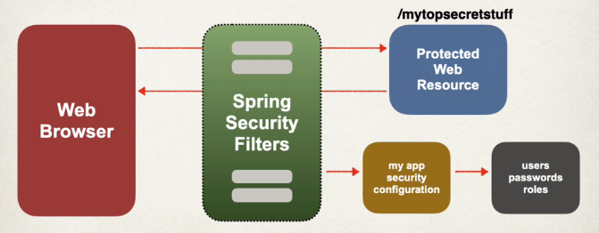
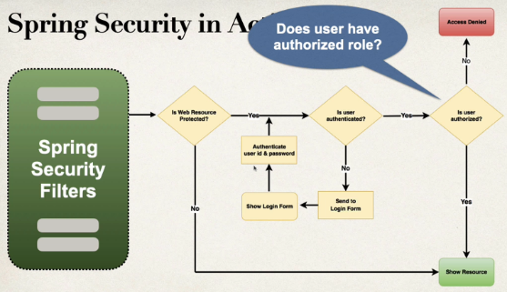
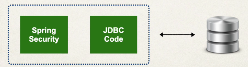
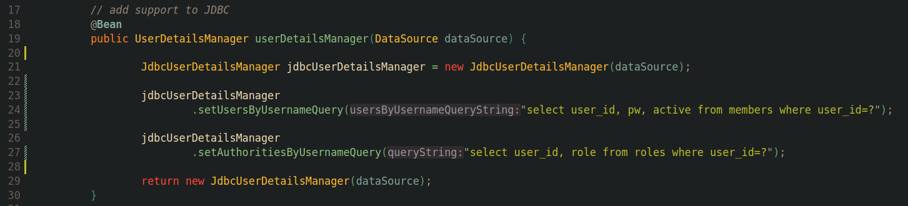
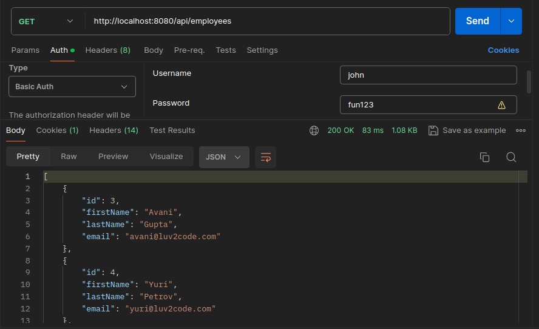
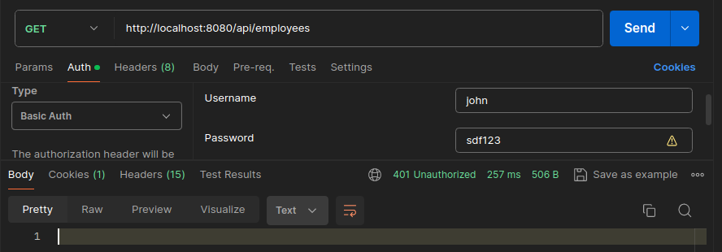
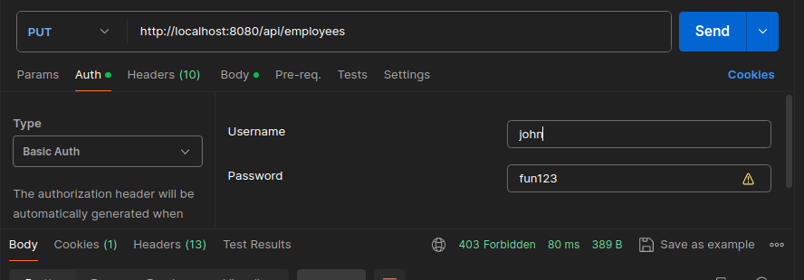
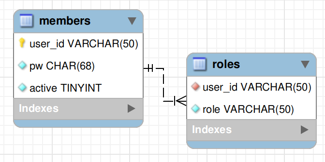

# Spring Boot  -  05  -  Security

Hello friends. 👋

I'd like to share with you my path learning. I've been learning for this week how implement the dependency **Security** from **Spring Boot**.

This implementation could be developed by SpringBoot and MySQL.

## Index 🚀
- [Overview](#overview)
- [The intern functionality about Spring Security](#the-intern-functionality-about-spring-security)
- [How read the roles from a Data Base](#how-read-the-roles-from-a-data-base)
- [Results](#results)
- [Apex](#apex)

## Overview
**Spring Security** has the work to filter what users can request resources according their authorities/roles.

### The intern functionality about Spring Security.
The most interesting thing about **Security** was how it apply filters to lets users to get the resources.

### How read the roles from a Data Base
Also, while I was developed. One thinking arrived into my mind, how I as developer can catch the privileges from any user from a DataBase. This requirement could be resolve by **Spring Security** and **JDBC Code** work together.

I needed to specify what tables with their columns should be used. This task was resolved using **Queries**.

### Results

- Code 200 - List employees 
- Code 401 - Incorrect pass 
- Code 403 - John has not the permits to create a new user 

### Apex
- Scheme MySQL 

## Message 😃
Please If you have any question about the project, you will send me a email to [carlosj12336@gmail](carlosj12336@gmail) 📧